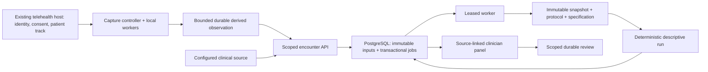

# PhenoMetrix architecture

The repository implements an ambient encounter integration substrate and retains
the original local ObservationV3 demo. Both serve the same three capabilities:
Ambient Capture, Personal Trajectory, and Clinician Evidence Card. Neither has
clinical validation. See the [integration runbook](encounter-integration.md) for
deployment interfaces and the [platform vision](telehealth-platform-vision.md)
for longer-term scope.

## Existing-host encounter path

A host supplies its authenticated session, encounter identity, participant track,
and explicit modality-specific consent. `packages/encounter-client` retrieves
the scoped capture context and submits derived observations. The browser entry
points are `apps/capture-web/src/embedded-encounter.ts` and
`integrated-encounter.ts`. They add no device prompt, patient login, questionnaire,
or capture screen. Provider review is optional and does not block the visit.

`packages/encounter-capture` owns capture authorization, participant attribution,
modality availability, stale-result rejection, and resource bounds. Its local
adapter attaches analysis to existing host media; it does not own the call's
tracks. Page visibility does not define encounter end. Host lifecycle and
authorization updates must be delivered to the controller.

The RTMS adapter is a reference transport with explicit participant selection,
handshake checks, and unsupported-format abstention. It supplies no qualified
RTMS measurement processor. The HFS protocol currently permits local pre-codec
and synthetic sources, not platform patient tracks. A real Zoom installation,
permissions, webhook trust, credentials, and acquisition validation remain
external integration work.

## Media and measurement boundary

The existing audio worklet transfers 20 ms PCM blocks to a worker with a bounded
ring. Face inference uses MediaPipe inside a worker. Native bitmaps, landmarks,
transformation matrices, and raw PCM do not enter durable observations.
Blendshapes are disabled. Only compact signal/geometry and quality primitives
reach the deterministic extractor.

The generic ambient registry contains 7 voice and 20 facial metrics. Extractors
screen qualified voice segments and facial bins, returning measured or withheld
outcomes with source windows and reasons. No transcript, embedding, or generated
clinical narrative is involved.

The encounter bridge rotates at most five-minute derived windows throughout a
longer visit. It rebases each window's analysis clock while retaining acquisition
timestamps, disposes transient primitives, and does not invent measurements in
gaps. Automatic facial calibration uses available qualified frames. Voice uses
a host noise reference or versioned passive screening of sufficiently long,
stable acoustic intervals; missing conditions withhold voice readiness. Both
noise-reference methods have explicit engineering-only provenance. Continuity
loss closes prior evidence before recalibration, and pre-calibration frames
cannot be qualified retroactively. Capture source and
processor versions are compatibility inputs. Device settings cannot establish
hardware identity or acquisition validity by themselves.

The integrated host entry point obtains three scoped authenticated clock probes
before capture and renews automatically before expiration. A separate trusted
clock monitor must attest the server's UTC error; its wall clock alone is
insufficient. The client conservatively combines round-trip time, source error,
timestamp resolution and a bounded drift allowance. Capture keeps one monotonic
timestamp mapping and accumulates uncertainty across renewals. Missing initial
qualification records an explicit uncertainty sentinel; a new offset cannot be
adopted halfway through a visit. Expiry, source changes or clock discontinuity
stop analysis. Synthetic clock evidence cannot qualify live acquisition.

Delivery waits briefly when needed to respect the service's knowledge-time
boundary. A transient upload retries the identical revision with bounded delay
and cancellation; exhausted delivery propagates to stop the measurement branch.
Final delivery remains cancellable by withdrawal after the encounter ends.

## Durable contracts and storage

The new contracts live in `packages/contracts/src/treatment-response.ts`.
They are separate from the unchanged legacy v3 schema:

- `DurableObservationV1`: scoped encounter, consent/binding references,
  measurement protocol, capture provenance, bounded evidence windows, terminal
  metrics, and explicit correction identity.
- Consent and participant binding: scoped authorization with modality limits
  and immutable envelope versions in the service.
- Treatment/context revisions: effective clinical time distinct from recorded
  knowledge time, date precision, source identity, product-specific dose units,
  cycles, concurrent context, and retractions.
- Protocol/specification: sealed intended use, metric definitions, source
  compatibility, baseline/phase rules, and prohibited claims.
- Snapshot/run/review: content-addressed analytical inputs/results and review
  bound to an exact run and digest.

`apps/encounter-service` uses PostgreSQL for episode metadata, append-only source
envelopes, immutable evidence, and reviews. A source write and its analysis job
commit in one transaction. Revision checks protect validation against concurrent
changes. Worker leases and input-revision fences prevent stale publication.
Expired leases can be reclaimed; repeated analysis failure becomes explicit
failed state. Replaying an old run requires its source revision and explicit
analysis time, including the authorization versions known then.

Authentication verifies signed issuer/audience and tenant, study, participant,
role, permission, and data-class claims. These claims must come from the host's
trusted identity integration. They do not provide enrollment or identity proofing.
Evidence retrieval checks current authorization and the actual source consents;
an unrelated new grant does not reopen withdrawn evidence.

FHIR ingestion is a bounded configured-source integration, not a general EHR
installation. Complete administrations and mapped procedures may establish
treatments; orders remain planned and medication statements remain context.
Source versions, receipt time, original dates, dose units, and unknown/day/exact
precision are preserved. Terminology, timezone mapping, patient matching, remote
credentials, and source provisioning require deployment configuration.

## Descriptive treatment alignment

`packages/trajectory-core/src/treatment-response.ts` is a pure deterministic
analysis over a sealed immutable history snapshot, protocol, and specification.
It does not query a database, call an LLM, infer an injection from conversation,
or execute a clinical action.

The first HFS research protocol selects existing left/right eye aperture and
left/right lid closure completeness. It does not detect or quantify spasms.
Its default engineering baseline uses at least two independent pretreatment
encounters within 56 days and a median of encounter medians. Follow-up phase
coverage extends to 112 days. These windows and thresholds are not validated
clinical recommendations.

The engine enforces scope, consent, binding, exact source/context/version
compatibility, quality, and chronology. It reports exclusions explicitly,
preserves treatment-date uncertainty, flags concurrent context and prior-cycle
carryover, and prevents index-cycle pooling across a subsequent injection.
Unknown or unverified treatment anchors retain qualified calendar measurements
without treatment-relative timing or baseline deltas.

Each run freezes its selected baseline and source versions. Corrections create a
new run while the previous run remains immutable. Sparse coverage and unknown
measurement error remain explicit. There are no fitted response curves,
interpolation, causal efficacy estimates, or clinical significance thresholds.

## Evidence and optional research media

`packages/evidence-core` creates a deterministic source-preserving projection.
`apps/clinician-review` provides an embeddable panel with calendar/treatment-time
views, native-unit points, exclusions, coverage, and per-point source/quality
inspection. Loading, pending, missing, withdrawn, and failed states are explicit.
The panel can use the existing-host service client. Durable clinician review
binds the authenticated actor to the exact evidence run.

`packages/research-governance` is a separate disabled-by-default clip boundary.
It requires separate research consent, scope/observation authorization, encrypted
storage, durable metadata, audit, retention limits, and deletion handling.
Routine capture does not invoke it. No production blob store, patient clip flow,
or institutional research approval is supplied. Access denial and physical
deletion are distinct operations; deployment retention workers and backup policy
must cover the latter.

## Legacy local demo retained

`pnpm dev` serves the original static browser demo. A participant asserts an
affected side, consents to separate device permissions, completes calibration,
and captures up to five minutes. Acquisition is disposed before the
ObservationV3 report is displayed. The generic report contains 27 outcomes.

The first live observation can be explicitly accepted in page memory, followed
by an independently consented second capture. The legacy comparator checks
subject, side, profile, protocol, metric, and processor compatibility before
showing six fixed facial rows and raw current-minus-reference differences.
Withheld/incompatible sources have no numeric delta. Accept/dismiss is local
demo state, not authenticated clinical review.

Reset, visibility loss, and page exit erase this demo's reference/report state.
This teardown policy is intentionally different from the embedded host path,
whose call continues when hidden. Legacy capture does not call the new service.
The old v2 history implementation remains removed; guided examples are archival.
The optional WavLM service is disconnected and disabled by default.

## Deployment and validation limits

Static asset checks establish delivery self-consistency. A trusted manifest and
binding checked bytes to executed assets still require deployment integrity work.
Real-device timing, host-track identity, browser lifecycle, platform quality,
and measurement repeatability require acceptance and validation beyond mocks.

No analytical or clinical validation, clinically meaningful change threshold,
scale equivalence, dose recommendation, emergency screening, or automated
clinical action is implemented. See [validation.md](validation.md).
