# PhenoMetrix architecture

This document describes the implemented ambient-v3 prototype and its narrow
two-live-capture unilateral facial movement research demo. Long-term platform
ideas in `telehealth-platform-vision.md` are not shipping behavior.

## Implemented flow

```mermaid
flowchart LR
    CONTEXT["Participant-asserted affected side"] --> C1["Consent + live capture 1"]
    C1 --> O1["Dispose media; ObservationV3 + report"]
    O1 --> ACCEPT["Explicitly accept in page memory"]
    ACCEPT --> REF["One accepted reference ObservationV3"]
    REF --> C2["Consent + live capture 2"]
    C2 --> O2["Dispose media; ObservationV3 + report"]
    REF --> COMPARE["Strict compatibility + six terminal rows"]
    O2 --> COMPARE
    COMPARE --> CARD["Deterministic condition evidence card"]
    CARD --> REVIEW["Optional page-local accept or dismiss"]
    REVIEW --> CLEAR["Reset, visibility loss, or reload clears all"]
```

Each `live capture` node contains the same independent camera-and-microphone
permission, calibration, ambient observation, worker processing, and
deterministic 27-metric extraction lifecycle described below. The microphone
remains part of this generic lifecycle in both sessions even though the
condition comparator selects only face metrics.

The browser is a static Vite application. It has no application server and
makes no measurement, comparison, or report API request. Nothing in the
diagram survives the current page.

## Capture boundary

Audio and face processing are independent.

The audio worklet transfers 20 ms PCM blocks to a worker. The worker maintains
a bounded two-second ring and emits only content-free signal frames. PCM,
waveforms, FFT bins, cepstra, MFCCs, formant tracks, transcripts,
spectrograms, embeddings, voiceprints, and device identifiers cannot enter an
observation.

The browser projects those compact frames into an eight-second, 800-sample
live energy/pitch history. Canvas painting is animation-frame throttled and the
history is cleared on finalization, discard, permission failure, reset, or page
exit. It does not feed an extractor or report.

The face worker owns MediaPipe inference. Native bitmaps, 478 landmarks, and
transformation matrices are scoped to worker processing and are not returned.
Blendshape output is disabled. The application receives normalized geometry, pose, compact
image-quality facts, cadence, processor provenance, face count, and track
continuity only.

For presentation, the application transfers a canvas to the face worker once
per session. The worker draws all 478 points, 2,556 tessellation edges, and the
eye, iris, brow, lip, and oval contours. Landmark updates follow inference
cadence while the presentation renderer may animate between updates.
The surface clears for zero or multiple faces and on every teardown path; its
pixels and landmark coordinates never enter application state.

## Calibration and lifecycle

After consent, camera and microphone permissions resolve separately. Available
lanes calibrate independently:

- audio requires a two-second technically quiet interval;
- face requires a 1.5-second stable, frontal, single-face interval; and
- setup terminalizes after 15 seconds.

At least one capture-capable lane is required to continue. A timed-out lane is
shown as not measurable rather than blocking the other lane. The ambient
observation can run for at most 300 seconds and can be ended or discarded at
any time.

Finish stops acquisition before creating the report. Discard, page hiding,
page unload, and stale asynchronous media resolution all use the same
generation-guarded disposal path. There is no separate in-session withdraw
control; during an active session, consent withdrawal is performed through
Discard, which routes to that same disposal path.

## Measurement and abstention

`@phenometrix/ambient-core` owns the frozen 27-metric registry and deterministic
extractors. Extractors receive derived frames only. They screen evidence into
qualified voice segments or five-second face bins, then return one terminal
outcome for every registered metric. Tier-1 frames and Tier-2 event records are
transient extractor inputs/outputs in the current browser; they do not enter
ObservationV3 and are not retained for later recomputation.

Abstention is first-class. Withheld reasons are closed, metric-specific protocol
values such as `no-usable-signal`, `insufficient-pitched-speech`,
`insufficient-bins`, `insufficient-exposure`, and `multiple-faces`. The adapter
must preserve these reasons exactly; an unregistered extractor reason is an
invariant failure, not a generic fallback.

## Observation and evidence

`buildAmbientObservation()` creates a strict ObservationV3 containing:

- anonymous session and subject references;
- the exact protocol and consent document digests;
- explicit, non-identity-verified source attribution;
- processor and asset-integrity provenance;
- exact source-window intervals;
- measured values only when evidence and attribution qualify; and
- one measured or withheld terminal outcome for all 27 metrics.

The in-memory workflow journal records consent, permission, calibration,
capture, measurement/withholding, observation, and report lifecycle events.
It is not a durable audit log.

`@phenometrix/evidence-core` validates the observation against the canonical
protocol registry and resolves evidence references before building the report.
The report contains capture quality plus nine metric sections. It has no
generated prose or clinical claim.

## Condition profile and page-memory state

`@phenometrix/condition-profiles` owns the immutable, content-addressed
`unilateral-facial-movement-research-demo` profile. Its intended use is a
within-page repeatability demonstration for an adult participant who asserts a
previously established unilateral peripheral facial palsy. The selected side
is participant-asserted, unverified, and locked across the two captures. Face
attribution still requires exactly one visible face and does not verify
identity.

The profile allowlists exactly six rows, in fixed display order:

1. Resting mouth difference (subject-left minus subject-right)
2. Resting eye-aperture difference (subject-left minus subject-right)
3. Subject-left lid closure completeness
4. Subject-right lid closure completeness
5. Spontaneous excursion difference (subject-left minus subject-right)
6. Oculo-oral coupling difference

The last two are marked experimental. **Oculo-oral coupling difference** is the
fixed safe label for an internal metric code that contains `synkinesis`; neither
the profile nor the UI may turn it into a claim that synkinesis was detected.

`ConditionDemoController` owns only the current participant context, accepted
reference ObservationV3, latest ObservationV3, and latest condition card in
page memory. The operator must explicitly accept the first observation as the
reference. Starting the follow-up preserves that reference and the asserted
side while resetting capture state and requiring consent again. New-participant
reset, document visibility loss, or page exit clears the condition state. The
`pagehide` handler also clears idle/reference and report state independently of
`visibilitychange`, so a cached-page restoration starts a new participant flow.

## Strict previous-session comparison

`@phenometrix/trajectory-core` is a synchronous, deterministic
ObservationV3-native comparator. It accepts exactly one explicitly accepted
reference, the current condition context, and one later current observation.
It does not query history or select a baseline.

Compatibility is fail-closed across subject reference, profile ID/version/
digest, asserted side, protocol ID/version/digest, capture-adapter ID/version,
chronology, metric presence, context, modality, native unit, algorithm version,
and processor reference/runtime/version/asset/integrity provenance. Every
allowlisted metric remains visible as one terminal `measured`, `withheld`, or
`incompatible` row with ordered reason codes; no row is silently dropped.

Only a compatible pair of measured outcomes produces a raw native-unit delta,
defined exactly as `current - reference`. A withheld or incompatible row has a
null delta. Its source objects are trace-only and deliberately cannot carry a
measured numeric value. Analytical repeatability and minimum detectable change
are fixed to `unknown`; no direction or clinical significance is inferred.

`@phenometrix/evidence-core` copies those exact comparison rows into a
deterministic six-row card and joins only fixed display metadata from the
condition profile. The card contains derived quality counts/minima, fixed
boundary and source disclosures, and a pending/accepted/dismissed page-local
review value. It has no narrative field, persistence, or export.

## Static assets

The browser verifies a committed SHA-256 manifest for the face model, voice
worklet, and MediaPipe WASM assets before device processing. Missing or changed
assets cause the affected lane to fail closed.

This currently verifies delivery-time self-consistency only: the manifest has
no independent trust anchor, and the verified bytes are discarded before the
processor loads the same URL again. Binding the executed bytes to a trusted
digest remains a required integrity design before deployment.

## Retained legacy boundaries

The guided calibration interfaces remain for compile compatibility and research
tests. They are disconnected from ObservationV3 and the live application.

The old `@phenometrix/trajectory-core` implementation and the v2 observation,
measurement, and event interfaces were removed on 2026-07-24. That package
compared one session scalar against an unordered bag of priors, was built on
superseded v2 contracts, and had no importers. The current package reuses the
name but is a new strict two-ObservationV3 comparator. It does not restore v2
history or persistence. Capture-provenance types shared with the former v2
files (`AudioPipelineProvenance`, `VideoCaptureSettings`, and siblings) remain
live.

The Python WavLM sidecar is restored as an optional loopback research service.
It is disabled by default, separately tested, and has no browser consumer.

Top-level guided protocol and example files are archival. They are not runtime
inputs and are not part of the active structure gate.

## Deferred

Persistence, more-than-one-reference history, baseline/trend estimation,
retained snippets, narrative synthesis, authenticated or durable clinician
review, export, PHI workflows, identity verification, analytical validation,
and clinical validation are intentionally absent. The page-local accept/dismiss
control is a research-demo state change, not governed clinical review.
